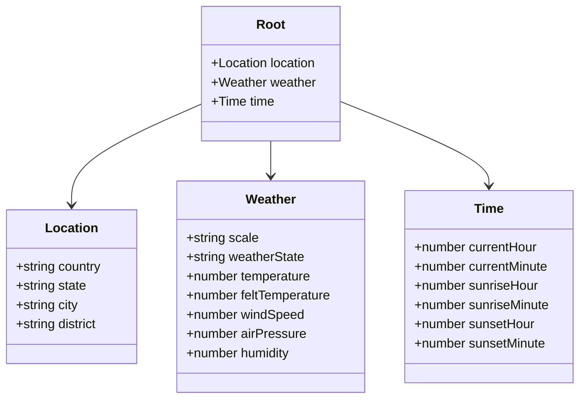

Projeto de criação de uma API Rest que serviria para um aplicativo de clima.

## Diagrama De Classes

```mermaid
classDiagram
    class Location {
        +string country
        +string state
        +string city
        +string district
    }
    
    class Weather {
        +string scale
        +string weatherState
        +number temperature
        +number feltTemperature
        +number windSpeed
        +number airPressure
        +number humidity
    }
    
    class Time {
        +number currentHour
        +number currentMinute
        +number sunriseHour
        +number sunriseMinute
        +number sunsetHour
        +number sunsetMinute
    }
    
    class Root {
        +Location location
        +Weather weather
        +Time time
    }
    
    Root --> Location
    Root --> Weather
    Root --> Time
```
