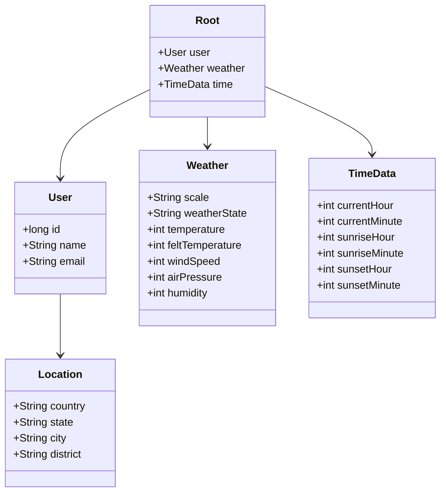
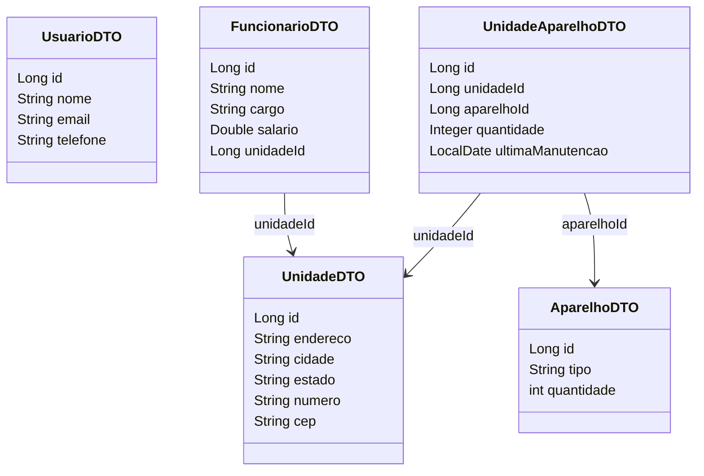

Projeto de criação de uma API Rest que serviria para um aplicativo de clima. Feito seguindo um projeto de código da DIO

## Diagrama De Classes



```mermaid
flowchart TD
  subgraph REST API
    A[POST /usuarios] -->|Request| A1[UsuarioDTO]
    A -->|Response| A2[201 Created]

    B[GET /usuarios/{id}] -->|Response| B1[UsuarioDTO]

    C[POST /unidades] -->|Request| C1[UnidadeDTO]
    C -->|Response| C2[201 Created]

    D[POST /funcionarios] -->|Request| D1[FuncionarioDTO]
    D -->|Response| D2[201 Created]

    E[POST /aparelhos] -->|Request| E1[AparelhoDTO]
    E -->|Response| E2[201 Created]

    F[POST /unidade-aparelhos] -->|Request| F1[UnidadeAparelhoDTO]
    F -->|Response| F2[200 OK]

    G[GET /unidade-aparelhos/unidade/{id}] -->|Response| G1[List<UnidadeAparelhoDTO>]
  end

  classDef entity fill:#f9f,stroke:#333,stroke-width:1px;
  class A1,A2,B1,C1,C2,D1,D2,E1,E2,F1,F2,G1 entity;
```
