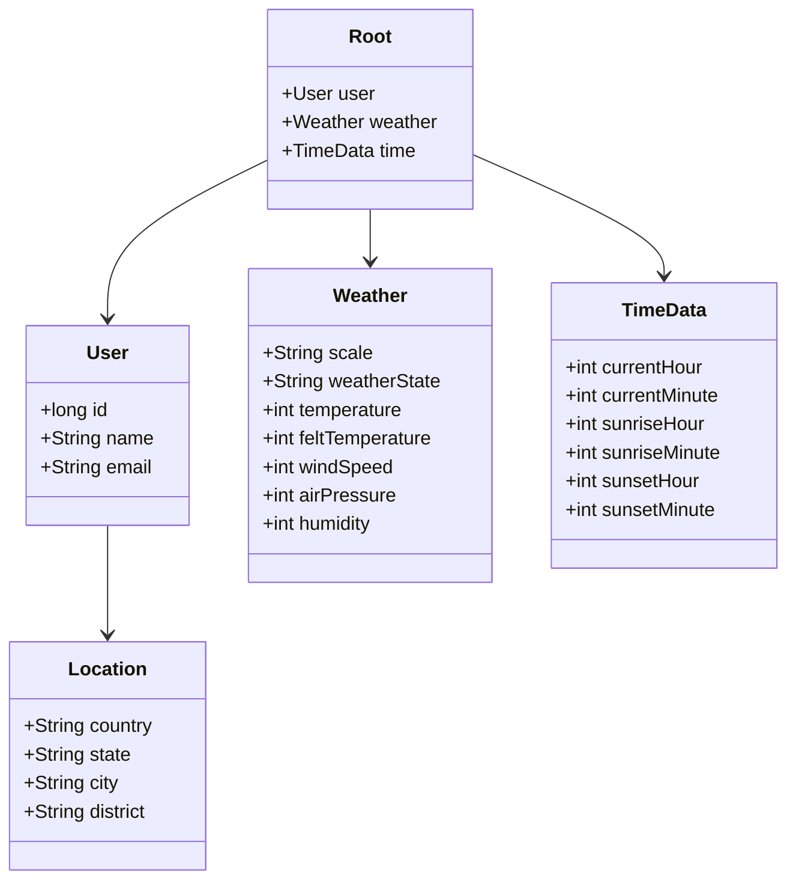

Projeto de criação de uma API Rest que serviria para um aplicativo de clima. Feito seguindo um projeto de código da DIO

## Diagrama De Classes

```mermaid
classDiagram
    class User {
        +long id
        +String name
        +String email
    }
    
    class Location {
        +String country
        +String state
        +String city
        +String district
    }

    class Weather {
        +String scale
        +String weatherState
        +int temperature
        +int feltTemperature
        +int windSpeed
        +int airPressure
        +int humidity
    }
    
    class TimeData {
        +int currentHour
        +int currentMinute
        +int sunriseHour
        +int sunriseMinute
        +int sunsetHour
        +int sunsetMinute
    }
    
    class Root {
        +User user
        +Weather weather
        +TimeData time
    }

    User --> Location
    Root --> User
    Root --> Weather
    Root --> TimeData
```

